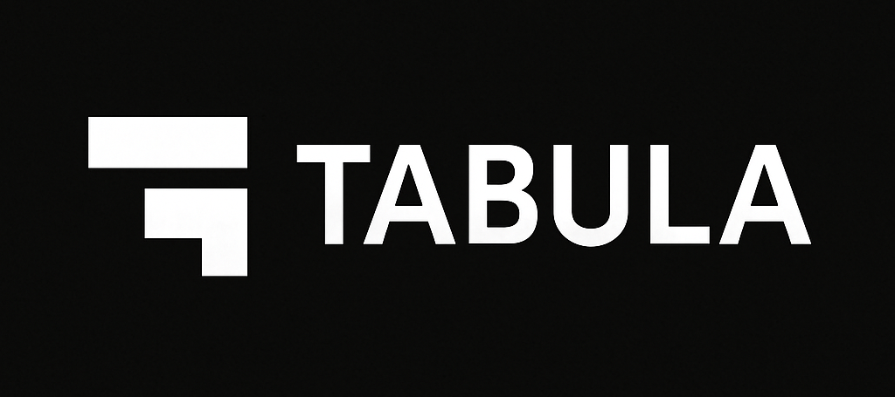

<div align="center">



# Tabula  
### A whitespace-structured programming language where **tabs** define scope and **spaces** define flow.

[](https://opensource.org/licenses/MIT)
[](https://www.rust-lang.org/)

</div>

Tabula is a modern compiled language that treats **whitespace as first-class syntax**.  
No braces. No semicolons. No visual noise.  
Your code becomes a clean, readable structure shaped entirely by indentation patterns.

---

## ✨ Why Tabula?

Tabula turns whitespace into logic:

- **TAB (`\t`) = Scope Operator**  
  Defines blocks, nesting, and structural hierarchy.

- **SPACE (` `) = Flow / Sequence Operator**  
  Controls inline grouping, argument passing, and chaining.

This creates an elegant syntax that reads like pseudocode but compiles like a systems language.

---

## 🧠 Core Concepts

### **Whitespace-First Syntax**
In Tabula, indentation *is the language*.  
The parser natively understands whitespace patterns as control structures.  
No braces, no semicolons—just clean, readable code.

### **Static + Shape Inference**
Strong typing like Rust, inference like Go.  
Minimal keywords, maximum clarity.  
Type checker with automatic inference.

### **Single Codebase: Native + WASM**
Tabula compiles to:
- Native binaries (LLVM backend)
- WebAssembly for frontend logic
- Interpreter for development

Perfect for full-stack systems and cross-platform development.

### **Professional Toolchain**
Complete development ecosystem:
- IDE integration via LSP
- Package management
- Testing framework
- Debugging tools
- Code quality checks
- Performance profiling
- Auto-generated documentation

---

## 🔣 Syntax Examples

### **Variables**
```

let name  "Mehmet"
let count  10

```

### **Functions**
```

func greet name
	print "Hello "  name

```

### **Conditionals**
```

if age > 30
	print "Adult"
else
	print "Young"

```

### **Loops**
```

for item in list
	process item

```

### **Inline Sequence**
```

result  compute x  y   z

```

---

## 🧩 Language Rules (Summary)

- `TAB` starts a **block** (scope/indentation)
- `SPACE` controls **inline order, grouping, and tuples**
- `NEWLINE` ends statements
- Modules are folder-based (like Go)
- Compiler supports both AOT and JIT modes
- Built-in formatter enforces consistent whitespace patterns
- Type inference for variables and functions
- Strong static typing with shape inference

---

## 🏗️ Project Goals

- ✅ Minimal, readable syntax  
- ✅ High performance  
- ✅ WASM-first design  
- ✅ Developer-friendly toolchain  
- ✅ Clean standard library for CLI, HTTP, async, FS, and math  
- ✅ Open-source from day one
- ✅ Professional IDE integration
- ✅ Comprehensive testing framework
- ✅ Full debugging support
- ✅ Code quality tools

---

## 📁 Repository Structure

```
/compiler          - Core compiler (lexer, parser, AST, codegen, wasm, typechecker)
/runtime           - Runtime system (VM, value types)
/std               - Standard library (IO, strings, collections, HTTP, async, math)
/lsp               - Language Server Protocol for IDE integration
/tabpm             - Package manager for dependency management
/repl              - Interactive REPL for development
/test-framework    - Testing framework
/debugger          - Debugger with breakpoints and step-through
/linter            - Code linter for quality checks
/profiler          - Performance profiler
/docgen            - Documentation generator
/docs              - Documentation
/examples          - Example programs
/tools             - Utility tools
```

---

## 🛠️ Development Tools

Tabula comes with a comprehensive suite of professional development tools:

### **Core Tools**
- **`tabula`** - Main compiler (build, fmt, run)
  - Compile to native binaries or WebAssembly
  - Format code automatically
  - Run programs interpretively
- **`tabula-lsp`** - Language Server Protocol for IDE integration
  - Code completion and IntelliSense
  - Go to definition
  - Real-time diagnostics
  - Document symbols
- **`tabpm`** - Package manager
  - Dependency management
  - Package publishing
  - Registry integration

### **Development Tools**
- **`tabula-repl`** - Interactive REPL
  - Real-time code execution
  - Syntax highlighting
  - History tracking
  - Error reporting
- **`tabula-test`** - Test framework
  - Unit testing support
  - Test discovery
  - Assertions
  - Verbose output
- **`tabula-debug`** - Debugger
  - Breakpoints support
  - Step-through execution
  - Variable inspection
  - Call stack viewing
- **`tabula-lint`** - Code linter
  - Style checking
  - Best practices enforcement
  - Auto-fix capabilities
  - Mixed indentation detection
- **`tabula-profile`** - Performance profiler
  - Function-level profiling
  - Execution time analysis
  - JSON and text output formats
- **`tabula-doc`** - Documentation generator
  - HTML documentation
  - Markdown output
  - Auto-generated from code
  - Module and function docs

### **Quick Start**

```bash
# Build everything
make build

# Run REPL
tabula-repl

# Compile program
tabula build -i program.tab -o program

# Run tests
tabula-test

# Lint code
tabula-lint src/

# Generate docs
tabula-doc src/ --format html
```

See [docs/tools.md](docs/tools.md) for detailed tool documentation.

---

## 🚧 Roadmap

### **Phase 1 — Grammar & Lexer** ✅
- ✅ Whitespace tokenizer
- ✅ Core tokens: TAB, SPACE, WORD, NUMBER, STRING, NEWLINE, EOF

### **Phase 2 — Parser & AST** ✅
- ✅ Block builder
- ✅ Inline operator analyzer
- ✅ Type inference engine

### **Phase 3 — Codegen** ✅
- ✅ LLVM backend (planned)
- ✅ WASM backend
- ✅ Interpreter

### **Phase 4 — Standard Library** ✅
- ✅ IO
- ✅ Strings
- ✅ Collections
- ✅ HTTP
- ✅ Async
- ✅ Math

### **Phase 5 — Tooling** ✅
- ✅ Formatter (`tabula fmt`)
- ✅ LSP server (`tabula-lsp`) - IDE integration
- ✅ Package manager (`tabpm`) - Dependency management
- ✅ REPL (`tabula-repl`) - Interactive development
- ✅ Test framework (`tabula-test`) - Unit testing
- ✅ Debugger (`tabula-debug`) - Breakpoints & step-through
- ✅ Linter (`tabula-lint`) - Code quality checks
- ✅ Profiler (`tabula-profile`) - Performance analysis
- ✅ Documentation generator (`tabula-doc`) - Auto-docs

---

## 🧪 Example Program

```

func main
	let x  10
	let y  20
	print "Sum:"  x + y

```

---

## 🚀 Installation

### **From Source**

```bash
# Clone repository
git clone https://github.com/makalin/tabula.git
cd tabula

# Build all tools
make build

# Install tools globally
make install
```

### **Available Commands**

After installation, you'll have access to:

```bash
tabula          # Main compiler
tabula-lsp      # Language server
tabpm           # Package manager
tabula-repl     # Interactive REPL
tabula-test     # Test runner
tabula-debug    # Debugger
tabula-lint     # Linter
tabula-profile  # Profiler
tabula-doc      # Documentation generator
```

### **VS Code Integration**

1. Install the Tabula extension (or configure manually)
2. Set `tabula.lsp.enabled` to `true` in settings
3. Enjoy IntelliSense, autocomplete, and real-time diagnostics!

---

## 📚 Documentation

### **Getting Started**
- [Grammar Specification](docs/grammar.md) - Complete language grammar
- [Syntax Guide](docs/syntax-guide.md) - Syntax examples and patterns
- [Tools Documentation](docs/tools.md) - All development tools explained

### **Advanced Topics**
- [Compiler Architecture](docs/compiler-architecture.md) - Internal compiler design
- [Contributing Guide](CONTRIBUTING.md) - How to contribute to Tabula

### **Examples**
Check out the [`examples/`](examples/) directory for sample programs:
- `hello.tab` - Hello World
- `variables.tab` - Variable usage
- `arithmetic.tab` - Math operations
- `conditionals.tab` - If/else statements
- `loops.tab` - For loops
- `functions.tab` - Function definitions

---

## 📜 License
MIT (Open Source)

---

## 👤 Author
Mehmet T. AKALIN
https://github.com/makalin

---

## ⭐ Contribute
Issues, ideas, optimizations, PRs — all welcome.  
Tabula is a language built for clarity. Help shape its future.

See [CONTRIBUTING.md](CONTRIBUTING.md) for guidelines.

---

<div align="center">

[⭐ Star on GitHub](https://github.com/makalin/tabula) · [📖 Documentation](docs/) · [🐛 Report Bug](https://github.com/makalin/tabula/issues) · [💡 Request Feature](https://github.com/makalin/tabula/issues)

</div>
